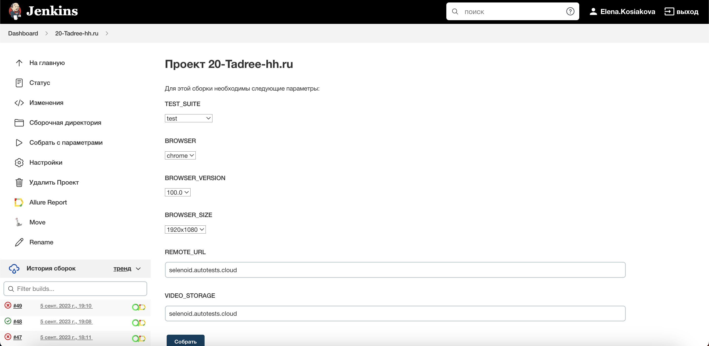
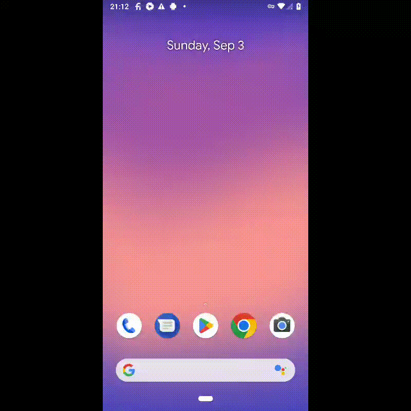

# Проект по автоматизации тестирования [hh.ru](https://hh.ru/)

### Технологии и инструменты:
<p align="center">
<a href="https://www.jetbrains.com/idea/"></a>
<a href="https://www.java.com/"></a>
<a href="https://github.com/"></a>
<a href="https://junit.org/junit5/"></a>
<a href="https://gradle.org/"></a>
<a href="https://selenide.org/"></a>
<a href="https://aerokube.com/selenoid/"></a>
<a href="https://qameta.io/allure-report/"></a>
<a href="https://qameta.io/"></a>
<a href="https://www.jenkins.io/"></a>
<a href="https://www.atlassian.com/ru/software/jira/"></a>
<a href="https://www.browserstack.com/"></a>
</p>

### Реализованные проверки:
#### UI 
* Отображение строки поиска на главной странице
* Проверка плейсхолдера строки поиска на главной странице
* Переход на страницу результатов поиска при выполнении поиска с главной страницы
* Переход на страницу расширенного поиска с главной страницы
* Отображение поисковых подсказок на главной странице
* Проверка заголовка на главной странице
* Отображение popup подтверждения региона на главной странице
* Проверка смены языка на английский на главной странице
* Отсутствие ошибок в логах консоли на главной странице
* Подстановка подсказки в поле "Ключевые слова" на странице расширенного поиска
* Переход на страницу результатов поиска при выполнении поиска со страницы расширенного поиска
#### API
* Поиск работодателя по наименованию
* Проверка пагинации при поиске работодателя
* Проверка ошибки авторизации при добавлении вакансии в избранное
* Проверка ошибки авторизации при подтверждении номера телефона
* Проверка получения поисковых подсказок
* роверка ошибки получения поисковых подсказок при отсутствии текста для поиска ключевого слова
#### Mobile
* Проверка заголовка главного экрана
* Проверка отображения релевантных поисковых подсказок
* Проверка отображения результатов поиска

### Запуск тестов из терминала
#### Локальный запуск тестов
##### Для UI тестов с параметрами из конфигурационного файла
```bash
gradle clean ui_tests -Denv=local
```
##### Для API тестов
```bash
gradle clean api_tests -Denv=local
```
#### Удаленный запуск тестов:
##### Для UI тестов с параметрами из конфигурационного файла
```shell
gradle clean ui_tests -Denv=remote
```

##### Для UI тестов с передачей параметров:
```bash
gradle clean ui_tests
-Dbrowser=${BROWSER}
-DbrowserVersion=${BROWSER_VERSION}
-DbrowserSize=${BROWSER_SIZE}
-DremoteDriverUrl=https://{REMOTE_DRIVER_LOGIN}:{REMOTE_DRIVER_PASSWORD}@${REMOTE_DRIVER_URL}/wd/hub/
-DvideoStorage=https://${VIDEO_STORAGE}/video/
```
где:
- <code>BROWSER</code> – браузер, в котором будут выполняться тесты
- <code>BROWSER_VERSION</code> – версия браузера, в которой будут выполняться тесты
- <code>BROWSER_SIZE</code> – размер окна браузера, в котором будут выполняться тесты
- <code>REMOTE_DRIVER_URL</code> – адрес удаленного сервера, на котором будут запускаться тесты
- <code>REMOTE_DRIVER_LOGIN</code> – логин удаленного сервера, на котором будут запускаться тесты
- <code>REMOTE_DRIVER_PASSWORD</code> – пароль удаленного сервера, на котором будут запускаться тесты
- <code>VIDEO_STORAGE</code> - адрес удаленного сервера, по которому можно получить видео

##### Для android тестов
```bash
gradle clean android_tests -Denv=local
```

###  Сборка в [Jenkins](https://jenkins.autotests.cloud/job/20-Tadree-hh.ru/)
<p align="center">

</p>
<p align="center">

</p>

1. Для запуска сборки необходимо перейти в раздел **Собрать с параметрами**
2. Запуская UI тесты, необходимо указать параметры для сборки и
      в <code>TEST_SUITE</code> выбрать ui_tests
3. Запуская API тесты или android тесты, можно оставить все предзаполненные поля, поменяв <code>TEST_SUITE</code>
      соответственно на api_tests или android_tests 
4. Запуская все тесты, необходимо указать параметры сборки для UI тестов и
      в <code>TEST_SUITE</code> выбрать test 
5. Нажать кнопку **Собрать**.

###  <a href="https://jenkins.autotests.cloud/job/20-Tadree-hh.ru/45/allure/">Отчет</a> в Allure report
#### Основная страница отчета
<p align="center">

</p>

#### Тест-кейсы
<p align="center">

</p>

###  Интеграция с [Allure TestOps](https://allure.autotests.cloud/project/3515/dashboards)
#### Dashboard
<p align="center">

</p>

#### Тест-кейсы
<p align="center">

</p>

###  Интеграция с [Jira](https://jira.autotests.cloud/browse/HOMEWORK-787)
<p align="center">

</p>

###  Уведомления в Telegram с использованием бота
<p align="center">

</p>

###  Пример видео выполнения UI теста на Selenoid
<p align="center">
  
</p>

###  Пример видео выполнения android теста в Browserstack
<p align="center">
  
</p>