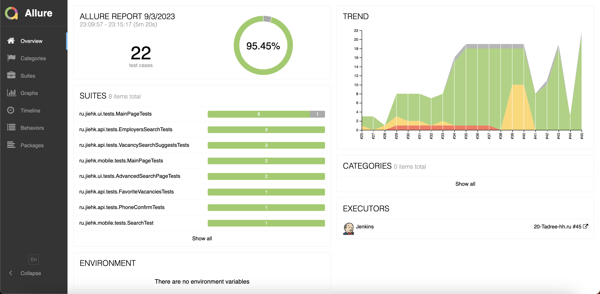
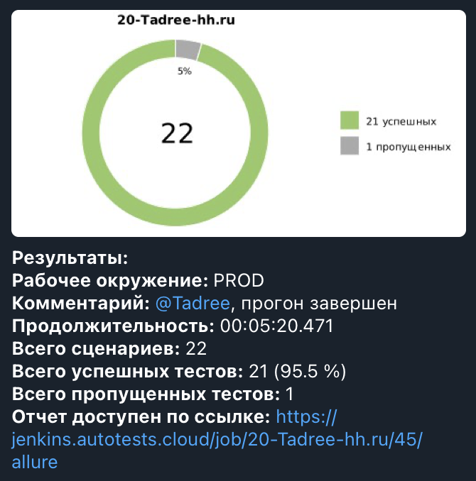

# Проект по автоматизации тестирования hh.ru

### Технологии и инструменты:
<p align="center">


</p>

### Реализованные проверки:
#### UI 
* Отображение строки поиска на главной странице
* Проверка плейсхолдера строки поиска на главной странице
* Переход на страницу результатов поиска при выполнении поиска с главной страницы
* Переход на страницу расширенного поиска с главной страницы
* Отображение поисковых подсказок на главной странице
* Проверка заголовка на главной странице
* Отображение popup подтверждения региона на главной странице
* Проверка смены языка на английский на главной странице
* Отсутствие ошибок в логах консоли на главной странице
* Подстановка подсказки в поле "Ключевые слова" на странице расширенного поиска
* Переход на страницу результатов поиска при выполнении поиска со страницы расширенного поиска
#### API
* Поиск работодателя по наименованию
* Проверка пагинации при поиске работодателя
* Проверка ошибки авторизации при добавлении вакансии в избранное
* Проверка ошибки авторизации при подтверждении номера телефона
* Проверка получения поисковых подсказок
* роверка ошибки получения поисковых подсказок при отсутствии текста для поиска ключевого слова

### Запуск тестов из терминала
#### Локальный запуск тестов с параметрами из конфигурационного файла:
```bash
gradle clean test -Denv=local
```
#### Удаленный запуск тестов с параметрами из конфигурационного файла:
```shell
gradle clean test -Denv=remote
```

#### Удаленный запуск тестов с передачей параметров:

```bash
gradle clean ${TEST_SUITE} 
-Dbrowser=${BROWSER}
-DbrowserVersion=${BROWSER_VERSION}
-DbrowserSize=${BROWSER_SIZE}
-DremoteDriverUrl=https://user1:1234@${REMOTE_DRIVER_URL}/wd/hub/
-DvideoStorage=https://${VIDEO_STORAGE}/video/
```
где: 

- <code>TEST_SUITE</code> – ттесттовый набор (UI тесты, API тесты)
- <code>BROWSER</code> – браузер, в котором будут выполняться тесты
- <code>BROWSER_VERSION</code> – версия браузера, в которой будут выполняться тесты
- <code>BROWSER_SIZE</code> – размер окна браузера, в котором будут выполняться тесты
- <code>REMOTE_URL</code> – адрес удаленного сервера, на котором будут запускаться тесты
- <code>VIDEO_STORAGE</code> - адрес удаленного сервера, по которому можно получить видео

###  Сборка в [Jenkins](https://jenkins.autotests.cloud/job/20-Tadree-hh.ru/)
<p align="center">

</p>

###  Отчет в Allure report
#### Основная страница отчета
<p align="center">

</p>

#### Тест-кейсы
<p align="center">

</p>

###  Интеграция с [Allure TestOps](https://allure.autotests.cloud/project/3515/dashboards)
#### Dashboard
<p align="center">

</p>

#### Тест-кейсы
<p align="center">

</p>

###  Интеграция с [Jira](https://jira.autotests.cloud/browse/HOMEWORK-787)
<p align="center">

</p>

###  Уведомления в Telegram с использованием бота
<p align="center">

</p>

###  Пример видео выполнения теста на Selenoid
<p align="center">
  
</p>